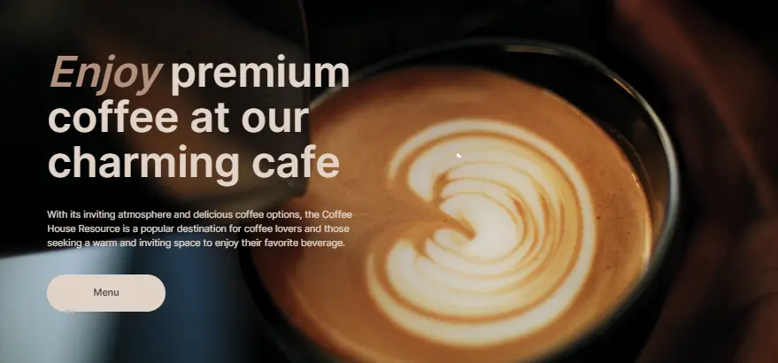
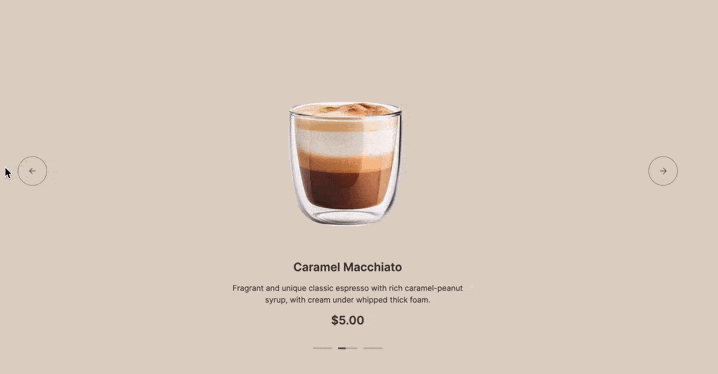
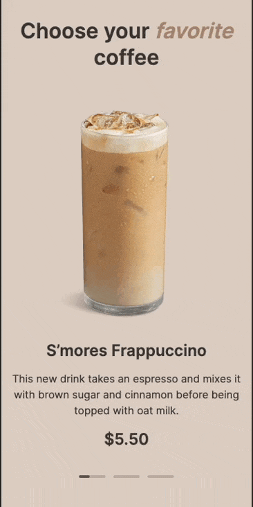

# Coffee House landing page

      



### [View a demo](https://anthony-th.github.io/coffee-house/ "live demo")

### Project's Description
Coffee House is a landing page consisting of two pages, responsive and with interactive elements, implemented according to PerfectPixel based on a Figma design

### Installation
1. Clone the repo:
```console
git clone https://github.com/anthony-th/hangman.git
```
2. Install the NPM packages in the project folder:
```console
npm install
```

## This project was implemented according to the criteria and rules outlined below:

### Project Work Stages
The task consists of three parts:

- `Coffee-House. Part-1: Fixed Layout`
    - In this part of the task, you need to create the 'Home' and 'Menu' pages based on the layout, which should display correctly when the window width is at least 1440px;
    - The validity of the work is checked, as well as its compliance with the layout.
- `Coffee-House. Part-2: Responsive Design`
    - In this part of the task, it is necessary to add responsiveness to the pages created in the first stage, up to and including a width of 380px;
    - The validity of the work is checked, its alignment with the layout at the corresponding page width, layout responsiveness, and the absence of horizontal scroll bars.
- `Coffee-House. Part-3: Adding Functionality`
    - In this part of the task, we use JavaScript to add interactivity to the pages;
    - The implemented functionality is being checked.

The duration of each part of the task is `1 week`.
The form of evaluation for each part of the task is a cross-check review.

[Design in Figma](https://www.figma.com/file/SAoBmuOqTfguehdT4IFRxQ/Coffee-House?type=design&node-id=0-1&mode=design&t=qis81E9Ovgx47eVl-0)

### Technical requirements
1. The layout is valid, semantic, and matches the design.
2. The application is displayed correctly and functions properly in the latest version of Google Chrome.
3. Using CSS frameworks (e.g., `Bootstrap`) is not allowed.
4. Using JS frameworks (e.g., `Angula`, `React`, `Vue`, etc.) is not allowed.
5. Using outdated libraries (e.g. `JQuery`, etc.) or pre-built libraries (e.g. `Swiper`, etc) to implement functionality is not allowed.
6. Using `TypeScript` is not allowed.
7. Using CSS preprocessors (`SASS`, `SCSS`), `normalize.css` is allowed.
8. Using a style reset with `reset.css` is not recommended.
9. Adding layout as an image by taking a screenshot of a part of the layout and pasting it into the markup is not allowed. Please use tags and characters for layout, and use images only for adding pictures and icons, not for layout elements (buttons, blocks, sections).
10. The code must be readable, without minification or obfuscation. You are allowed to use bundlers, such as `Vite` or `Webpack`, but enable `source maps`. Gulp is unmaintained and should not be used.

##### Details: *(click to view)*

<details><summary>Coffee-House. Part-1: Fixed Layout</summary>

##### CrossCheck Criteria

1. Checking validation of pages:
  - The layout for both pages is validated and error-free according to the W3C Validator ([https://validator.w3.org/](https://validator.w3.org/)) Valid markup of checked page corresponds to the message "Document checking completed. No errors or warnings to show."
  - Favicon is added to each page
  - Each page has only one `<h1>` element
  - The URL of the menu page differs from the URL of the home page (e.g. your-site.com for the home page and your-site.com/menu for the menu page)
2. The layout matches the design:
  - `<header>` block on each page
  - `Enjoy` block on `home` page
  - `Favourites Coffee` block on `home` page
  - `About` block on `home` page
  - `Mobile App` block on `home` page
  - `Menu` block on `menu` page
  - `<footer>` block on each page
3. CSS Requirements:
  - For positioning images in About block on home page and products in Menu block on menu page used Flexbox or Grid Layout
  - When scaling the browser page (<100%) or increasing the page width (>1440px), the layout of both pages is centered rather than shifted to the side and not stretched across the entire width
  - The background color Body stretches across the entire width of the page
4. Interactivity:
  - Navigation elements (except `Contact us`) lead to corresponding blocks on `home` page (anchor links)
  - `Contact us` in navigation panel links to the `<footer>` block on its own page (anchor link)
  - Smooth scrolling with anchor links
  - When clicking on the Menu buttons in `header` and `Enjoy` block on `home` page, it navigates to the `menu` page
  - The Menu button in `header` on `menu` page is non-interactive
  - When clicking on the Logo in `header`, it navigates to the home page
  - The active Coffee button in `Menu` block of `Menu` page is non-interactive
  - Each Coffee-card in the `Menu` section of the `Menu` page is interactive when hovering over any area of the card
  - In the `<footer>` block, clicking on the link with phone number (all area including icon) should initiate a phone call
  - In the `<footer>` block, clicking on the link with the address (all area including icon) should open a new browser tab with Google Maps displaying any location of your choice
  - Interactivity of links and buttons is implemented according to Figma layout. Interactivity includes not only changing cursor's appearance, for example, using the `cursor: pointer` property, but also the use of other visual effects, such as changing the background color or font color, following the Styleguide in Figma layout
  - Mandatory requirement for interactivity: smooth change in the appearance of an element on hover, without affecting adjacent elements

</details>

<details><summary>Coffee-House. Part-2: Responsive Design</summary>

##### CrossCheck Criteria

1. The layout of the pages aligns the design at a screen width of 1440px:
   - `<header>` block on each page
   - `Enjoy` block on `home` page
   - `Favourites Coffee` block on `home` page
   - `About` block on `home` page
   - `Mobile App` block on `home` page
   - `Menu` block on `menu` page
   - `<footer>` block on each page
2. The layout of the pages aligns the design at a screen width of 768px: **+14**
   - `<header>` block on each page
   - `Enjoy` block on `home` page
   - `Favourites Coffee` block on `home` page
   - `About` block on `home` page
   - `Mobile App` block on `home` page
   - `Menu` block on `menu` page
   - `<footer>` block on each page
3. The layout of the pages aligns the design at a screen width of 380px: **+14**
   - `<header>` block on each page
   - `Enjoy` block on `home` page
   - `Favourites Coffee` block on `home` page
   - `About` block on `home` page
   - `Mobile App` block on `home` page
   - `Menu` block on `menu` page
   - `<footer>` block on each page
4. There is no horizontal scrollbar at all screen width up to 380px inclusive. All page content remains as per the design: it is not cropped, removed, or shifted to the side
   - `home` page: no horizontal scroll bar between 1440px and 768px widths
   - `home` page: no horizontal scroll bar between 768px and 380px widths
   - `menu` page: no horizontal scroll bar between 1440px and 768px widths
   - `menu` page: no horizontal scroll bar between 768px and 380px widths
5. During smooth resizing of the browser window from 1440px to 380px, the layout occupies the full width of the window (including specified margins), elements adjust their sizes and positions appropriately without full scaling, no elements overlap, and images maintain their correct aspect ratios
   - On `home` page
   - On `menu` page
6. At screen widths of 768px and below, the menu and navigation buttons in the header are concealed on both pages, and a burger menu icon is displayed  
   (Note: Activation of the burger menu icon is not evaluated at this stage.)
7. Hover effects are active on desktop devices (as per the `Desktop` device type in DevTools) and are disabled for mobile devices (as per the `Mobile` device type in DevTools) on both pages
8. The layout for both pages is validated and error-free according to the W3C Validator ([https://validator.w3.org/](https://validator.w3.org/))

</details>

<details><summary>Coffee-House. Part-3: Adding Functionality</summary>

##### CrossCheck Criteria

1. Implementation of the burger menu on both pages:
   - At a page width of 768px or less, the navigation panel hides, and the burger icon appears
   - When clicking the burger icon, the burger menu slides out from the right, and the burger icon smoothly transforms into a cross
   - The burger menu occupies the entire available screen area below the `<header>` block
   - When clicking the cross, the burger menu smoothly hides, moving to the right of the screen, and the cross smoothly transforms into a burger icon
   - The burger icon is created using HTML and CSS without the use of images
   - Links in the burger menu work, providing smooth scrolling to anchor points
   - When clicking on any link (interactive or non-interactive) in the menu, the burger menu smoothly hides to the right, and the cross smoothly transforms into a burger icon
   - The placement and dimensions of elements in the burger menu match the layout (horizontal centering of menu items)
   - When the page width increases to 769px or higher, the burger icon and the open burger menu hide, and the navigation panel appears
2. Implementation of the Carousel on the `home` page:
   - Carousel elements are automatically scroll to the left with a specified time interval by default. The time interval duration is at the student's choose, but the recommended value is 5-7 seconds
   - The current state until the next automatic switch is shown in the progress bar of the corresponding slide by filling it with color
   - Only the progress bar of the current slide can be filled; the rest remain in their default state
   - When hovering the mouse or touch-and-hold on the displayed carousel element, the time to the element switch is paused. When the mouse cursor moves out, or the hold ends, the time continues from where it stopped
   - The switch slides is accompanied by like the carousel animation (the method of animation execution is not verified)
   - Manual switching in the corresponding direction is implemented by pressing left arrow button or right arrow button
   - For mobile devices, manual switching in the corresponding direction is additionally implemented by swiping left or right
   - When manually switching, the progress bar state of the switched slide resets, and the progress bar of the displayed slide starts to fill
   - When switching to the right after the third element, it returns to the first. When switching to the left after the first element, it returns to the third
   - Example of carousel operation on desktop:
     
   - Example of carousel operation on mobile:
     
3. Implementation of the Category switching for products on the `menu` page
   - The Coffee category is active and the corresponding products are displayed when opening or reloading the `menu` page
   - When switching categories, the products of the selected category are displayed
4. Implementation of the Loading more products on the `menu` page 
   - For screens with a width of 768px or less, when opening/reloading the page or switching categories, only 4 products are displayed. If there are more than 4 products in the displayed category, a Load More button is displayed below
   - When clicking the Load More button below the displayed products, the missing products are added, and the Load More button is hidden
   - When changing the screen width, the product display mode (8 products per page or 4 products with a Load More button) changes without page reloading
5. Implementation of the Modal for selected product on the `menu` page:
   - The Modal with the description of a specific product opens when clicking on any part of a card of product
   - The part of the page outside the Modal is darkened
   - When the Modal is open, the vertical scroll of the page becomes inactive; when closed, it becomes active again
   - Clicking on the area around the Modal and Close button closes it
   - The Modal is centered on both axes, sizes of modal elements and their layout match the design
   - After the Modal is opened, the 'Size' option 'S' is selected, and no option in the 'Additives' section is selected. The product's final price is the same as in the card
   - Only one 'Size' option can be selected. Changing this option also changes the final price of the product based on the choice (+\$0.00 for S, +\$0.50 for M, +\$1.00 for L)
   - Multiple 'Additives' options can be selected, and each selected option increases the final price of the product by \$0.50
6. Video on the `home` page
   - In the `Enjoy` block of the `home` page, a video is played in the background instead of an image, without sound and control elements, and without the ability to interact with it
   - After the video is finished, it automatically starts over

##### Penalties
- If the layout of the entire design or individual blocks is implemented using images
- The use of frameworks, libraries, and technologies that are prohibited in the technical requirements

</details>